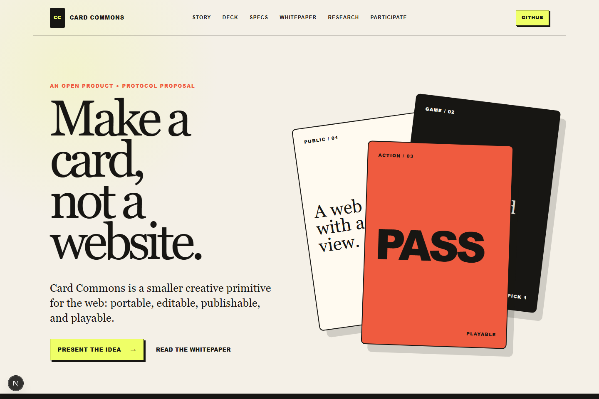
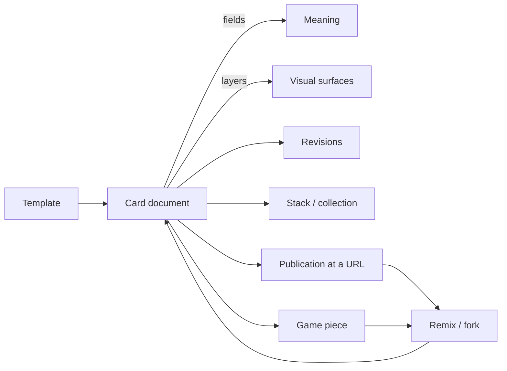
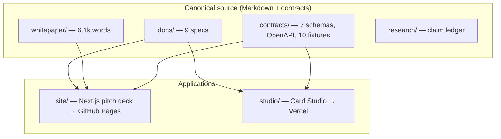
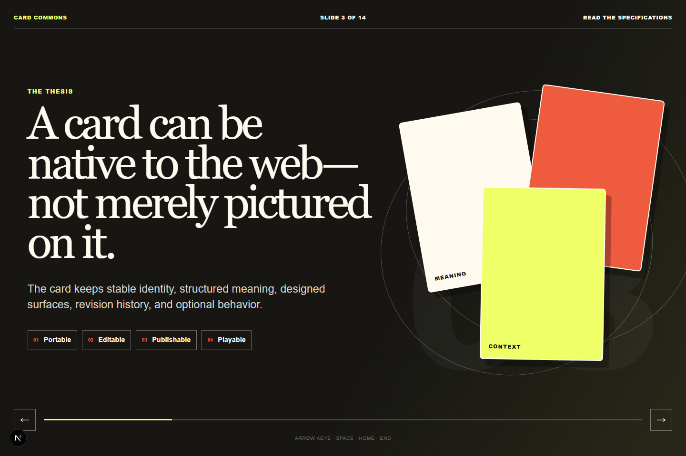
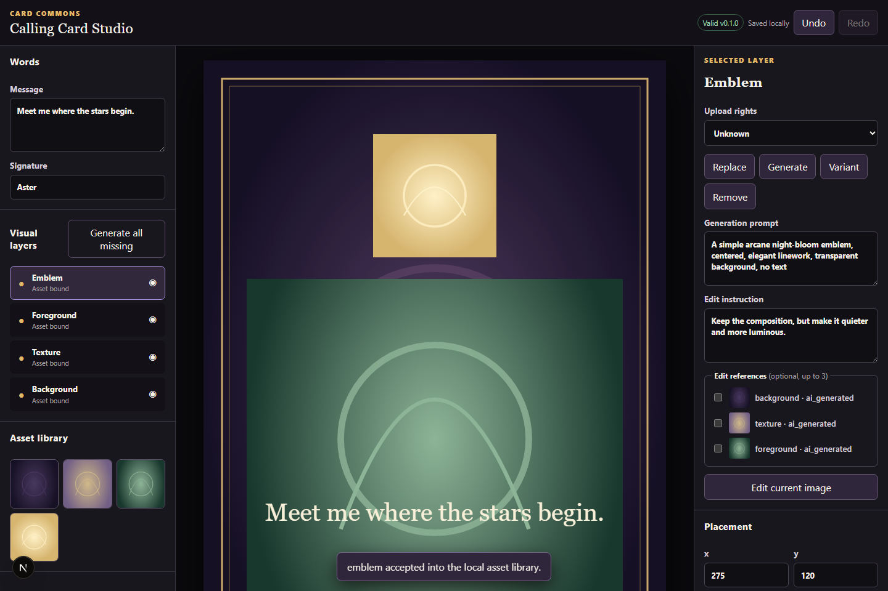
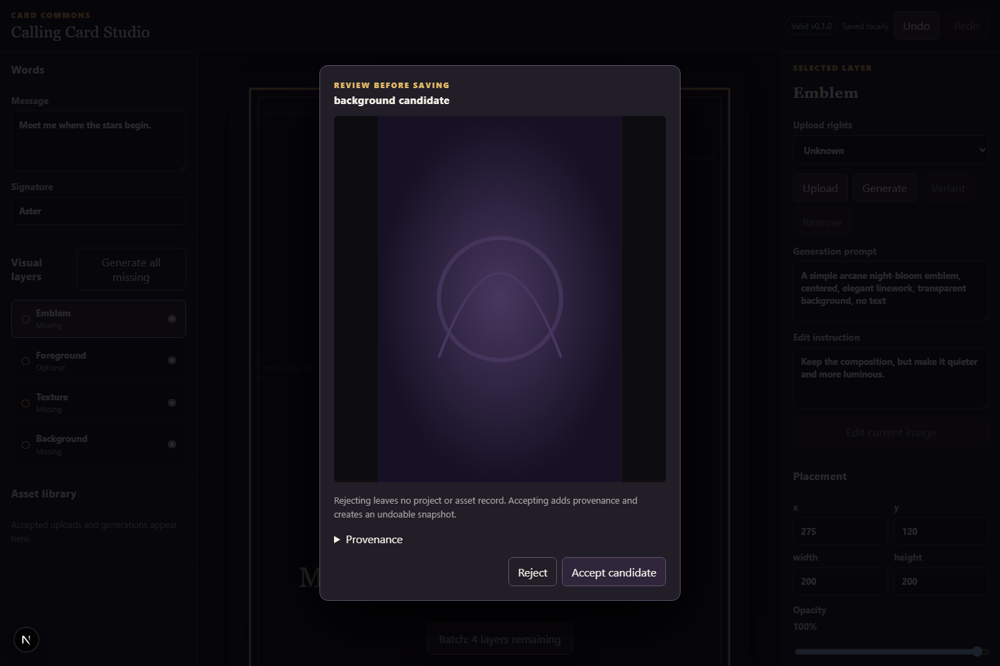
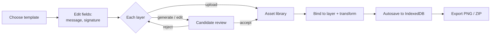

# Card Commons

**Make a card, not a website.**

Card Commons is an open specification for portable, editable, publishable,
playable web objects. A card can stand alone at a URL, join a stack, become an
episode in a series, act as a game piece, or be remixed into a new system
without collapsing into a flat image.



This repository is a publication, engineering-handoff, and early-product
package. It contains the product requirements, protocol model, JSON Schemas, an
OpenAPI contract, a whitepaper, a web-native pitch deck, and the first
private-pilot **Card Studio** that actually creates a card.

## Core invariant

> A card is a portable, editable, publishable, playable web object.

Structured **fields** express what a card means. **Layers** express how a card
looks. **Surfaces** adapt the same card to card, thumbnail, public, game, print,
and social contexts. **Revisions** preserve history; **publications** pin stable
public views; **collections** and **games** give cards context and behavior.



## What's in the package



The website renders the canonical Markdown directly rather than maintaining
duplicate prose, so the specs, whitepaper, and deck never drift apart.

### Start here

- [Executive brief](docs/00-executive-brief.md)
- [Product requirements](docs/01-product-requirements.md)
- [Card protocol and domain model](docs/02-card-protocol-and-domain-model.md)
- [System architecture](docs/03-system-architecture.md)
- [Whitepaper](whitepaper/card-commons.md)
- [Research and claim ledger](research/claims.md)
- [Card Studio](studio/README.md)

## The pitch deck

A 14-slide, keyboard-, touch-, and URL-navigable deck makes the product and
protocol argument for both builders and strategic readers.



## The Card Studio

The Studio is a deliberately narrow product slice: it creates **one**
`calling_card`, persists it and its assets locally in the browser (IndexedDB),
and exports a 1500×2100 PNG plus a portable ZIP. It is **not** the eventual
publishing, stack, or game application.

Every visual layer — background, texture, emblem, foreground — can be
**uploaded** or **AI-generated**, edited, or varied. Generated and uploaded
images enter the same reusable asset library and carry provenance.



Image generation runs through a protected, OpenAI-backed endpoint. Each
candidate is reviewed and explicitly accepted or rejected before it becomes a
provenance-bearing asset; rejected candidates leave no trace.





## MVP

The first product proves four loops:

1. Create a structured card from a template. *(Studio: in progress)*
2. Arrange cards into a stack, deck, or series.
3. Publish a card or collection at a stable URL.
4. Build and play a prompt-response game, then remix it non-destructively.

Custom domains, a universal game engine, a marketplace, deep social
networking, and advanced ontology editing are explicitly deferred.

## Development

Requirements: Node.js 22+ and npm 10+. This is an npm workspaces monorepo
(`site`, `studio`).

```bash
npm install
npm run dev          # publication site (GitHub Pages target)
npm run dev:studio   # Card Studio (Vercel target)
npm run check        # lint, schema/OpenAPI validation, typecheck, tests, build
```

The Studio needs a few environment variables to run its generation endpoint;
see [studio/.env.example](studio/.env.example) and the
[Studio README](studio/README.md).

## Status

Version `0.1.0` is a proposal intended for engineering review, prototyping,
user research, and protocol discussion.

| Area | State |
| --- | --- |
| Specs, schemas, OpenAPI, whitepaper | Published and committed |
| Pitch-deck site | Built; deploys to GitHub Pages |
| Card Studio | Built and committed; typecheck clean, 15/15 unit tests pass |
| Studio image generation | Verified against **mocked** images only |
| Live OpenAI run + Vercel deploy | **Pending** (needs API key and deploy creds) |

The screenshots above are from the running apps; the Studio images were produced
with the mock-image test harness, not a live model.

Normative language in the protocol specification uses **MUST**, **SHOULD**, and
**MAY** in their ordinary requirements sense; it is not yet an internet standard.

## Licensing

- Software: [MIT](LICENSE)
- Prose, diagrams, and other content: [CC BY 4.0](LICENSE-CONTENT.md)
