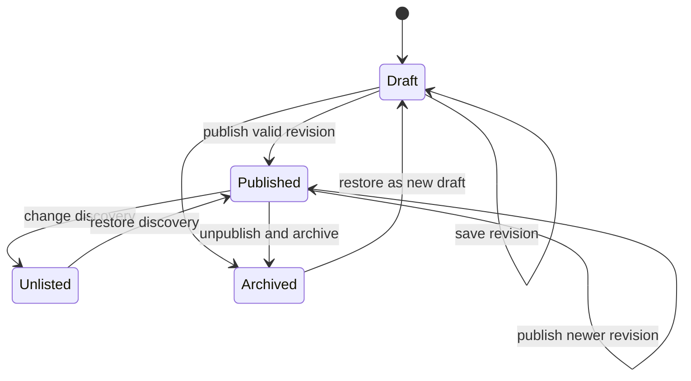

# Card protocol and domain model

## Conformance

The machine-readable source of truth is
[`contracts/schemas/card-document.schema.json`](../contracts/schemas/card-document.schema.json).
This document explains its semantics. A conforming producer MUST emit documents
that validate against the declared `schemaVersion`. A conforming consumer MUST
reject unsupported major versions and MUST NOT silently discard unknown data
while claiming lossless round-trip support.

## Identity and revision

`Card` is the stable public identity. `CardDocument` is the contents of one
revision.

- A card ID MUST remain stable across revisions.
- A revision MUST be immutable after creation.
- Revision numbers MUST increase within a card.
- Publication MUST pin an explicit revision.
- Deleting a draft MUST NOT invalidate a previously published revision.
- A fork MUST receive a new card ID and MAY record source lineage.

Version 0.1 uses opaque string identifiers and optional canonical URLs.
Federated identity is deliberately unresolved.

## Fields and layers

A field stores semantic content. Each field declares a data type, value,
source, visibility, and lock state. A producer SHOULD use stable field keys
defined by a card kind or template.

A layer stores visual presentation. Layers belong to surfaces and may bind to
a field through `fieldKey`. A renderer MUST resolve the field value at render
time rather than copying it into the layer. Unbound decorative layers are
allowed but SHOULD include an accessible role of `presentation`.

This rule prevents visual drift: changing `promptText` updates every bound
surface.

## Surfaces

A surface is a context-specific view of the same card:

- `card`: primary bounded composition;
- `thumbnail`: compact browse view;
- `public`: full public web presentation;
- `game`: interactive game representation;
- `social`: share preview;
- `print_front` and `print_back`: physical output;
- custom keys for extension contexts.

Each surface defines dimensions, a layout mode, background, ordered layers, and
optional interaction zones. A surface MUST have a unique key within a
document. A renderer MUST respect layer order. Interactive zones MUST expose
equivalent semantic controls outside purely spatial interaction.

## Card kinds

Version 0.1 defines:

| Kind | Required semantic intent |
| --- | --- |
| `text_card` | A primary text field |
| `image_card` | A primary image reference and alternative text |
| `web_card` | A headline plus body, image, or canonical link |
| `calling_card` | A message or identity statement |
| `prompt_card` | Prompt text and prompt game role |
| `response_card` | Response text and response game role |
| `pass_card` | An explicit pass action |
| `custom` | Producer-defined fields with no implied behavior |

Templates MAY add constraints but MUST NOT contradict the kind. A card can
change kind only in a new revision and only if the resulting document
validates.

## Classification and relations

Classifications connect a card to a scheme and path with a declared role. They
do not determine ownership or collection membership.

Relations connect one card to another using types such as `answers`, `cites`,
`requires`, `remixes`, or a namespaced custom value. Consumers MUST tolerate
unknown relation types. Relations are assertions by the current document, not
proof that the target agrees.

## Permissions and visibility

Visibility controls discovery:

- `private`: authorized principals only;
- `workspace`: members of the owning workspace;
- `unlisted`: accessible by URL but excluded from discovery;
- `public`: discoverable and shareable.

Permissions grant actions to principals. A consumer MUST apply the most
restrictive result when visibility and permissions conflict. A document's
permissions are descriptive exchange data; the authoritative service MUST
enforce access independently.

## State lifecycle

Text equivalent: a card begins in draft, may accumulate immutable revisions,
and may publish any valid revision. Published cards can move between public and
unlisted discovery. Archiving removes active publication but does not erase
history; restoration creates a new draft.

## Portability

A portable export MUST include the `CardDocument` and SHOULD include a manifest
for referenced assets. Assets MAY be embedded or addressed by URI. Producers
MUST identify unavailable, expired, or rights-restricted assets rather than
substituting them silently.

Importers MUST:

1. validate before persistence or rendering;
2. preserve the source document for audit;
3. mint local identity unless explicitly performing a trusted synchronization;
4. resolve asset policy;
5. record provenance; and
6. report lossy transformations.

## Accessibility

Every card MUST have an accessible name. Meaningful images MUST have
alternative text. Reading order MUST derive from semantic fields or an
explicit accessibility order, not from absolute coordinates. Color, animation,
and pointer interaction cannot be the sole carriers of meaning.

## Compatibility

`schemaVersion` follows semantic versioning. During `0.x`, a minor release may
break compatibility and MUST provide migration notes. Extensions belong under
namespaced metadata or custom relation and classification values. Producers
SHOULD prefer extensions over redefining core fields.

