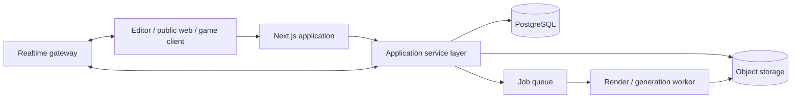

# System architecture

## Architectural principle

The protocol package defines cards, the renderer displays them, the editor
changes documents, collections organize them, games apply rules, publishing
assigns public views, and generation proposes assets or content. No feature
owns a private reinterpretation of the card model.

## Recommended topology



Text equivalent: clients use one web application. Its service layer writes
stable entities and immutable revisions to PostgreSQL, assets to object
storage, and long-running work to a queue. Workers produce derived assets.
Live game messages pass through a realtime gateway while the application
service remains authoritative.

## Modules

- `card-schema`: TypeScript types, JSON Schema, migrations, fixtures.
- `card-renderer`: deterministic semantic-to-visual rendering.
- `editor`: command-based document changes, history, selection, autosave.
- `collections`: membership, roles, ordering, bulk operations.
- `publishing`: validation, revision pinning, routes, metadata, unpublish.
- `game-engine`: prompt-response state machine and move validation.
- `assets`: upload, metadata, rights, variants, signed delivery.
- `generation`: provider adapters, prompt context, jobs, acceptance.
- `identity-access`: users, workspaces, roles, policies, audit.

The MVP may ship as a modular monolith. Module boundaries are code and data
ownership rules, not a requirement for networked microservices.

## Persistence

Use relational records for identity, ownership, queryable state, and
relationships. Store the complete revision document in JSONB.

Key records:

- `cards`: stable identity and current pointers;
- `card_revisions`: immutable validated documents;
- `collections` and `collection_memberships`;
- `publications`: subject, path, visibility, pinned revision;
- `assets` and `asset_variants`;
- `games`, `game_sessions`, and append-only `game_moves`;
- `generation_jobs`;
- `audit_events`.

The database MUST enforce unique slugs within their namespace, unique revision
numbers per card, unique collection membership when duplicates are
disallowed, and referential integrity for pinned revisions.

## Save and publish flow

1. The client edits an in-memory document through typed commands.
2. Autosave sends a base revision ID, an idempotency key, and the proposed
   document.
3. The service authenticates, authorizes, validates, and checks optimistic
   concurrency.
4. A successful save creates one immutable revision and advances the draft
   pointer.
5. Publish reruns validation, verifies assets and rights, creates or updates a
   publication, and pins the revision.
6. Render caches are derived and replaceable; they are never the source of
   truth.

Conflicting saves return `409 Conflict` with the current base revision. The
client must offer reload, compare, or explicit fork—not silent last-write-wins.

## Game authority

Game clients submit intent, not state. A move contains session, player, type,
payload, expected sequence, and idempotency key. The server authenticates the
player, validates phase and permissions, applies a deterministic transition,
persists the move and resulting state atomically, then broadcasts a
player-specific projection.

Private hands and unrevealed cards MUST never appear in a public session
snapshot. Random operations MUST use a server-controlled seed and record
enough information for an authorized audit.

## Asset and generation pipeline

Uploads land in quarantine, undergo MIME sniffing and malware checks, receive
metadata, and are promoted to durable storage only after validation. Delivery
uses immutable versioned keys or signed URLs.

Generation is asynchronous:

```text
validated context → queued job → provider → quarantined output
→ safety/rights metadata → user review → accepted asset → card revision
```

Provider prompts, settings, source assets, and policy results are audit data.
Secrets and provider credentials never enter card documents.

## Authorization

Use workspace-scoped role-based access plus object-level checks:

- owner: administer workspace and all objects;
- editor: create and modify permitted objects;
- player: interact with joined game sessions;
- viewer: read visible objects.

Every mutation checks subject, action, object, workspace, and current state.
Public visibility is not edit permission. Unlisted is not a security boundary.
Exports and asset URLs receive the same authorization treatment as HTML views.

## Operational requirements

- Structured logs correlate request, user, object, revision, job, and session.
- Metrics cover validation failures, save latency, publish failures, render
  duration, generation cost/failure, and game transition errors.
- Audit events record sensitive access, publication, permission, import,
  export, generation acceptance, and deletion.
- Backups cover relational data and asset manifests; restore tests are
  scheduled.
- Derived renders can be rebuilt from pinned revisions and assets.

## Deployment evolution

Start with a managed PostgreSQL database, S3-compatible storage, one Next.js
application, a worker process, and a managed realtime or WebSocket service.
Split services only when load, trust boundaries, or independent deployment
needs justify the operational cost.

