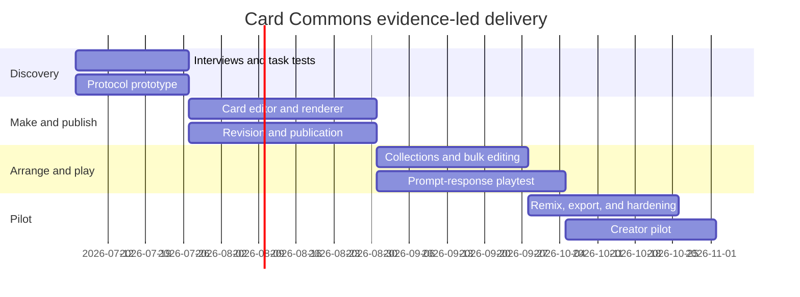

# MVP delivery plan

## Delivery strategy

Build a thin vertical slice of the card lifecycle before expanding editor
freedom or game breadth. Every milestone produces a usable prototype and an
evidence decision.

Text equivalent: discovery and a protocol prototype run first and in parallel.
Card editing/rendering and publication follow. Collections and prompt-response
play build on those foundations. Remix, export, hardening, and a creator pilot
complete the MVP.

Dates are planning anchors, not commitments, and should be re-baselined after
staffing.

## Milestone 0: evidence and protocol

- Conduct 12–18 task-based interviews across independent publishing, game
  making, archiving/education, and protocol implementation.
- Test low-fidelity create, arrange, publish, play, and remix flows.
- Implement schema validation and a reference renderer for example documents.
- Round-trip fixtures through two independent parsing contexts.

Gate: users understand a structured card without lengthy explanation, and the
team can render the same fixture deterministically in two contexts.

## Milestone 1: make and publish

- Authentication, workspaces, card identity, immutable revisions.
- Text, image, web, calling, prompt, response, and PASS templates.
- Content-first editor and constrained design controls.
- Asset upload, accessibility metadata, and rights state.
- Public card route, revision pinning, unpublish, JSON/PNG export.

Gate: five external users publish valid cards; draft changes never alter the
published revision; import/export passes fixture tests.

## Milestone 2: arrange

- Shared collection records and memberships.
- Grid, list, and table views.
- Reorder, batch create, bulk edit, and validation preview.
- Public stack, deck, and series views.

Gate: users create 50-card collections without one-at-a-time editing, and the
same card participates in multiple collections safely.

## Milestone 3: play

- Prompt-response rules profile and deck validation.
- Lobby, join flow, private hands, round phases, judge, score, completion.
- Idempotent moves, reconnection, authoritative projections, audit log.
- Integrated playtest in the game builder.

Gate: four-player sessions complete under reconnection and duplicate-request
tests without leaking private hand state.

## Milestone 4: remix and pilot

- Card, collection, and game fork flows.
- Attribution, source lineage, and asset-policy checks.
- One structure-aware generation action with human acceptance.
- Onboarding, telemetry, moderation basics, operational runbooks.

Gate: invited creators complete each core loop, at least one object is reused
across publication and play, and no severity-one privacy or authorization
defects remain.

## Test strategy

- Contract: JSON Schema positives, targeted negatives, migration fixtures.
- Domain: revision, publication, collection, remix, and game invariants.
- Integration: database transactions, object storage, job retries, access
  policy, import/export.
- End-to-end: first card, stack, game, publication rollback, remix lineage.
- Accessibility: keyboard, screen reader landmarks, zoom, contrast, reduced
  motion, non-spatial manipulation.
- Security: cross-workspace access, hidden game data, unsafe assets, injection,
  signed URL scope, idempotency abuse.
- Reliability: reconnect, retry, queue failure, stale draft, render rebuild,
  backup restore.

## Primary risks and responses

| Risk | Early signal | Response |
| --- | --- | --- |
| Card constraint feels rigid | users immediately request blank canvas | increase template and slot flexibility, not unbounded freedom |
| Product feels like another image generator | users export once and do not reuse | foreground collections, structure, import/export, and remix |
| Too many concepts at onboarding | creation abandonment | reveal structure progressively through task-specific templates |
| Game engine consumes roadmap | rules exceptions proliferate | hold the prompt-response profile boundary |
| Protocol outruns user need | schema debates without completed tasks | require prototype evidence for new core concepts |
| Rights and privacy become ambiguous | assets lack source or visibility | block publication until provenance state is explicit |

## Release definition

MVP release requires validated protocol artifacts, a threat model, migration
and backup procedures, WCAG 2.2 AA review of core journeys, performance budgets,
moderation/reporting, and a published list of known limitations.

